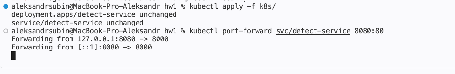
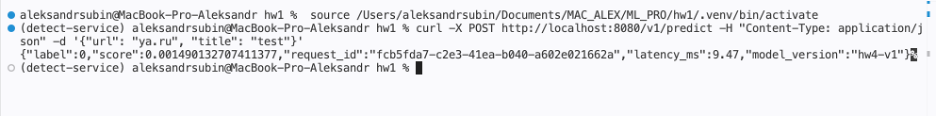
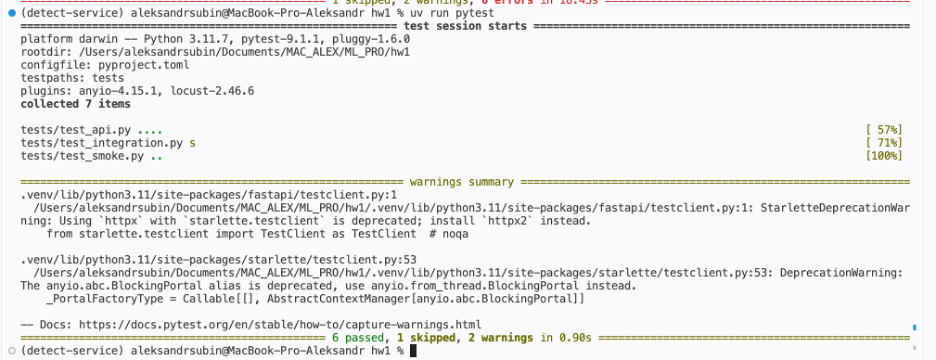
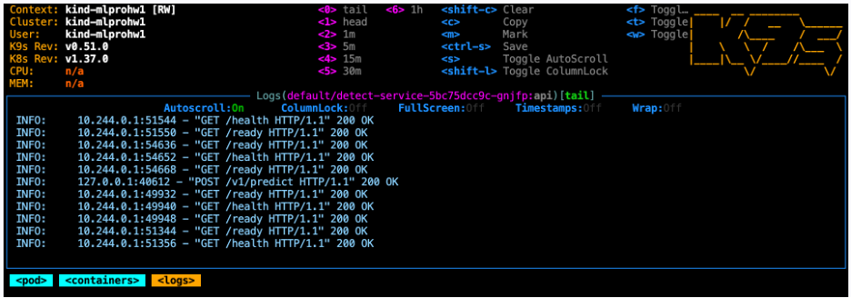
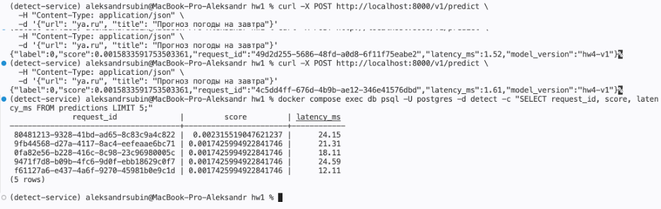

**Звёздочка 1**

| Прогон  | RPS | Median (ms) | p95 (ms) | Max (ms)|Ошибки (%) |
| ----------- | ----------- | ----------- | --|--|--|
|10 users|32.18|3|7|85.88|0.0|
|50 users|158.64|4|9|82.75|0.0|
|100 users|313.18|6|31|152.24|0.0|

**Звёздочка 2**

aleksandrsubin@MacBook-Pro-Aleksandr hw1 % uv run python measure_batch.py
1:   1.2349999999999999 ms
500:  31.165 ms
25.23x
aleksandrsubin@MacBook-Pro-Aleksandr hw1 % 
