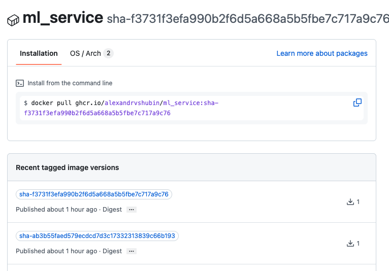

# ML  — ДЗ 2

## 

| Пункт задания                   | Ссылка / подтверждение                                                  |
| ------------------------------- | ----------------------------------------------------------------------- |
| CI/CD: tests, build, deploy     | https://github.com/alexandrvshubin/ml_service/actions/runs/36332095950  |
| GHCR image с sha-тегом          | https://github.com/alexandrvshubin/ml_service/pkgs/container/ml_service |
| Поломка ConfigMap: красный      | https://github.com/alexandrvshubin/ml_service/actions/runs/36312065323                                                       |
| Поломка Secret: красный         | https://github.com/alexandrvshubin/ml_service/actions/runs/36313766899                                                     |
| Поломка Secret: зелёный         | https://github.com/alexandrvshubin/ml_service/actions/runs/36331208744                                                      |
| Поломка Resources: красный      |https://github.com/alexandrvshubin/ml_service/actions/runs/36332058872  |
| Поломка Resources: зелёный      | https://github.com/alexandrvshubin/ml_service/actions/runs/36332095950       |

## 2. Семь вопросов

### 1. Сколько секунд шёл job build в первом прогоне и сколько во втором? Какой слой Dockerfile взят из кэша и почему именно он?

1) in 1m 24s 2)in 23s 

#11 [stage-0 6/7] COPY src/ src/
#11 CACHED

#12 [stage-0 2/7] COPY --from=ghcr.io/astral-sh/uv:latest /uv /bin/uv
#12 CACHED

#13 [stage-0 3/7] WORKDIR /app
#13 CACHED

#14 [stage-0 4/7] COPY pyproject.toml uv.lock ./
#14 CACHED

#15 [stage-0 5/7] RUN uv sync --no-dev --no-install-project
#15 CACHED

#16 [stage-0 7/7] RUN uv sync --no-dev
#16 CACHED

### 2. В логе deploy во время выката видны поды в ImagePullBackOff, а прогон при этом зелёный. Откуда эти поды и почему это не ошибка?

Поды со статусом `ImagePullBackOff` относятся к старому ReplicaSet `detect-service-fd96cffb5`, который появился при применении Deployment с исходным образом `detect-service:latest`. Эти pod пытались получить образ `detect-service:latest` из `docker.io/library`, поэтому получили `ErrImagePull`, а затем `ImagePullBackOff`. После этого workflow выполнил `kubectl set image` и перевёл Deployment на актуальный образ из GHCR с SHA-тегом; старый ReplicaSet был уменьшен до нуля, а новый ReplicaSet успешно запустил две реплики сервиса. В итоге состояние самого Deployment стало успешным, поэтому наличие старых pod в процессе rollout не означает ошибку финального состояния.

Ссылка на прогон:
https://github.com/alexandrvshubin/ml_service/actions/runs/36313589759/job/108604180315

### 3. Какой путь проходит пароль базы от страницы настроек GitHub до переменной окружения в поде? Почему его нельзя положить в configmap.yaml?

Во время deploy GitHub Actions получает секрет и командой kubectl create secret generic detect-secrets создаёт в Kubernetes объект Secret. Затем Deployment подключает detect-secrets через envFrom, поэтому значение секрета попадает в переменную окружения контейнера. В configmap.yaml пароль класть нельзя, потому что ConfigMap предназначен для обычной конфигурации и не обеспечивает механизм хранения секретных данных

### 4. Уберите мысленно needs: tests у job build. Опишите сценарий, в котором это закончится плохо.

Если убрать needs: tests, build сможет запуститься независимо от результата тестов

### 5. Почему на pull request у вас бегут только тесты, а build и deploy нет? Какая строка за это отвечает и зачем так сделано?
  build:
    needs: tests
    if: github.ref == 'refs/heads/main'
    runs-on: ubuntu-latest

  deploy:
    needs: build
    runs-on: ubuntu-latest

### 6. Зачем в init() стоит pg_advisory_xact_lock? Что произойдёт без него при двух репликах и пустой базе? Реплики чего именно здесь имеются в виду?
блокировка заставляет их выполнять этот участок по очереди. Без неё две реплики одновременно обратятся к пустой базе и обе начнут выполнять CREATE TABLE IF NOT EXISTS; это создаёт гонку при первоначальной инициализации.

### 7. В трёх ваших красных прогонах поды застряли в трёх разных статусах. Расположите эти статусы в порядке жизни pod и объясните, на каком шаге возникает каждый.
Pending → ImagePullBackOff → CrashLoopBackOff


## 3. Журнал проблем

### 3.1. Намеренно сломанный тест в Pull Request

Для проверки процесса работы через Pull Request тест `test_predict_smoke` был намеренно изменён: вместо ожидаемого кода ответа `200` в нём было установлено ожидание `201`.

После запуска CI job `tests` завершился с ошибкой. В логе pytest указано:

```text
FAILED tests/test_smoke.py::test_predict_smoke - assert 200 == 201
```

и далее:

```text
E       assert 200 == 201
E        +  where 200 = <Response [200 OK]>.status_code
```

При этом остальные тесты прошли: `7 passed`, `1 failed`.

Красный прогон:

https://github.com/alexandrvshubin/ml_service/actions/runs/36311477521/job/108598132732

После этого тест был исправлен обратно на ожидаемый код `200`, после чего был создан исправляющий коммит и проверка должна была завершиться успешно.

Зелёный прогон:

(https://github.com/alexandrvshubin/ml_service/actions/runs/36331208744)

---

### 3.2. Поломка Resources

Для воспроизведения ошибки ресурсов в `requests.memory` было задано заведомо некорректное значение, из-за которого Kubernetes не смог нормально выполнить rollout Deployment.

#### Прогон №14

Красный прогон:

https://github.com/alexandrvshubin/ml_service/actions/runs/36332058872/job/108655938430

Job:

```text
deploy
```

На шаге:

```text
Run kubectl apply -f k8s/
```

ресурсы были приняты, однако rollout Deployment не завершился:

```text
Waiting for deployment "detect-service" rollout to finish:
1 out of 2 new replicas have been updated...
```

после чего Kubernetes завершил ожидание ошибкой:

```text
error: timed out waiting for the condition
```

Итоговый код шага:

```text
Process completed with exit code 1
```

Таким образом, в этом запуске проблема проявилась уже во время rollout Deployment: новые реплики не смогли завершить обновление в установленный таймаут.

Зелёный прогон после исправления ресурсов:
https://github.com/alexandrvshubin/ml_service/actions/runs/36332095950